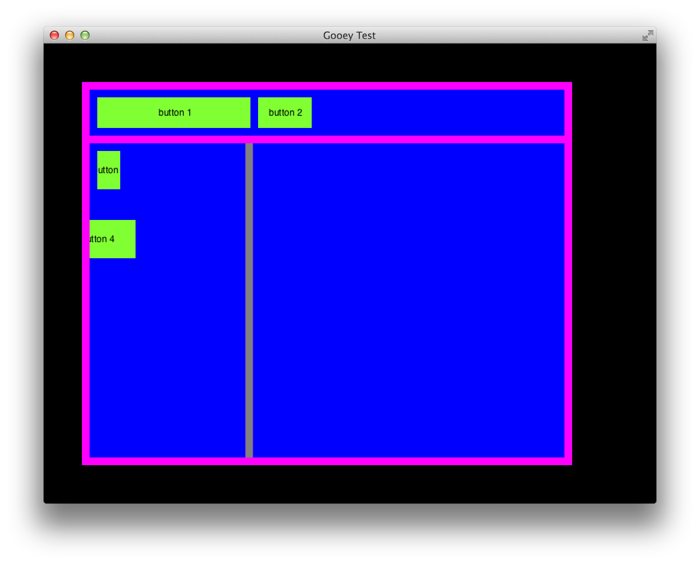

# gooey

UI library for SDL/cairo.

Current status: unfinished & useless

Not sure what direction this is going to take.

## Screenshot

This shows a toolbar, various buttons, panels and vertical split view.

## References

Cairo docs: http://cairographics.org/documentation/

## TODO

### Next Up

  - [x] Event capturing e.g. for handling clicks/drags
  - [x] Decide how coordinate system should work for nested views
  - [x] Panel (background color, subviews)
  - [x] Split view - groundwork
  - [ ] Split view - drag-resize 
  - [x] Use clipping when rendering containers
  - [ ] SDL container view
  - [ ] Knob
  - [ ] Slider
  - [ ] Layout manager for toolbar
  

This leaves: text inputs, labels, check boxes, radio buttons, floating windows, key windows

### Deferred

  - [ ] Use HW accelerated rendering (i.e. `SDL_Renderer`)

## General Deficiencies

  - Raw pointers are used liberally. They should be replaced with smart pointers.
  - No consideration has yet been given whatsoever to setting the cursor.
  
## Limitations

  - Assumes ARGB32